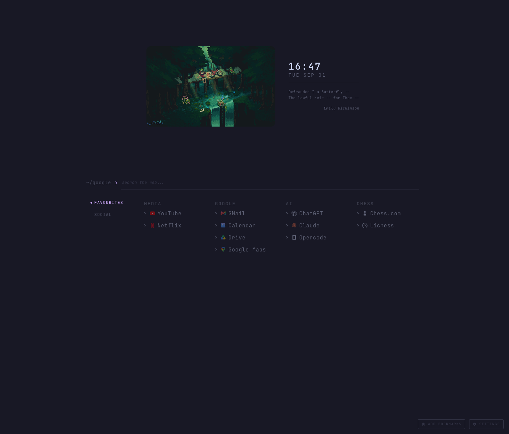

# Sweet-page
Simple browser startpage made with HTML, TailwindCSS and plain JS.  



I wanted to learn JS with a first simple project and this is the result. It is not vibe coded, I
used Claude mostly to improve the look of the UI and to get some assistance with JS for some minor
things, but I'm responsible for all the JS logic and project structure, proof: the bad logic and
project structure.  

## Featuers
- Search bar.
- Store and group bookmarks in tabs and subcategories.
- Minimal settings page.
- Simple JSON editor to edit the bookmarks in the browser.
- You get a random poetry every day. Poetries are fetched from [poetryDB](https://github.com/thundercomb/poetrydb/tree/master).

All the settings are saved in the browser's local storage.  
For now, the only way to export the list of boookmarks is by copying the content of the JSON editor,
I'm planning to make it easier in the future (and maybe to substitute that JSON editor with
something better).

## How to use
The app comes with a docker container:
```sh
docker run -d -p 8080:80 --restart unless-stopped dreadcrumbs/sweet-page:latest
```

After this command you can access the page at http://localhost:8080. It will be restarted on every
reboot (if your docker daemon is enabled) so that's all you need to run it locally. You can
customize the local port by changing `8080` in the command above with another value.

### Getting the icons
Icons can be added from [iconify](https://iconify.design), just search the icon you want from
[here](https://icon-sets.iconify.design/) and copy its name into the `incon` key of the JSON editor.

# In case you wonder
- **Why the poetries?** Because I like poetry, obviously.  
- **Why many banners have dolomites in them?** Because I live nearby the dolomites, I find them to be heaven on
earth. Everything associated with them is beautiful so this startpage is beautiful by osmosis.  
- **Why "Sweet-page" instead of a name more to the point like "Poet-page" or "Literature-page" or
  something?** I don't know, it sounded good, and poetries are sweet I guess(?).

# Roadmap 
- [x] Add icon support for bookmark links
- [x] Add settings support
- [x] Add cover image and poetry
- [x] Add subcategories inside the same tab
- [x] Select banners from settings
- [x] Add button to easily add new bookmarks
- [ ] Add calendar and google events
- [ ] Add export and import settings
